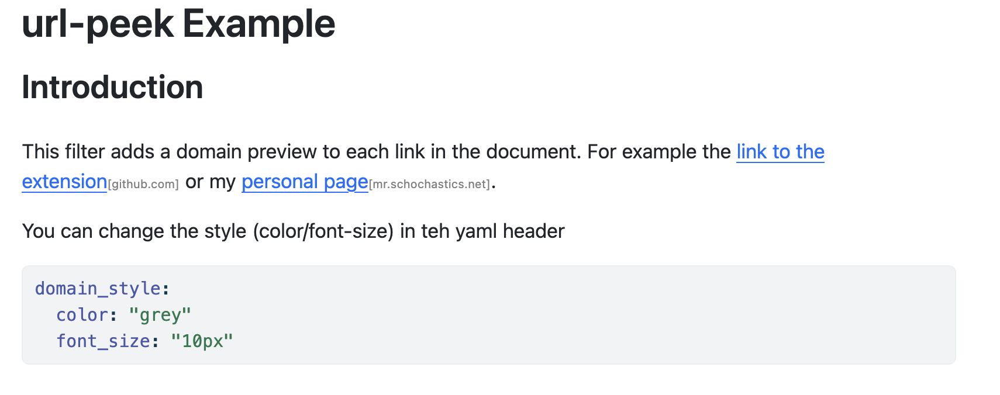

# url-peek Extension For Quarto

This filter adds a domain preview next to links in your documents, providing users with quick context on the destination without needing to hover or click.



## Installing


```bash
quarto add schochastics/url-peek
```

This will install the extension under the `_extensions` subdirectory.
If you're using version control, you will want to check in this directory.

## Using

The styling of the domain preview is controlled in the yaml header via 
```yaml
domain_style:
  color: "grey"
  font_size: "10px"
```

## Example

Here is the source code for a minimal example: [example.qmd](example.qmd).

